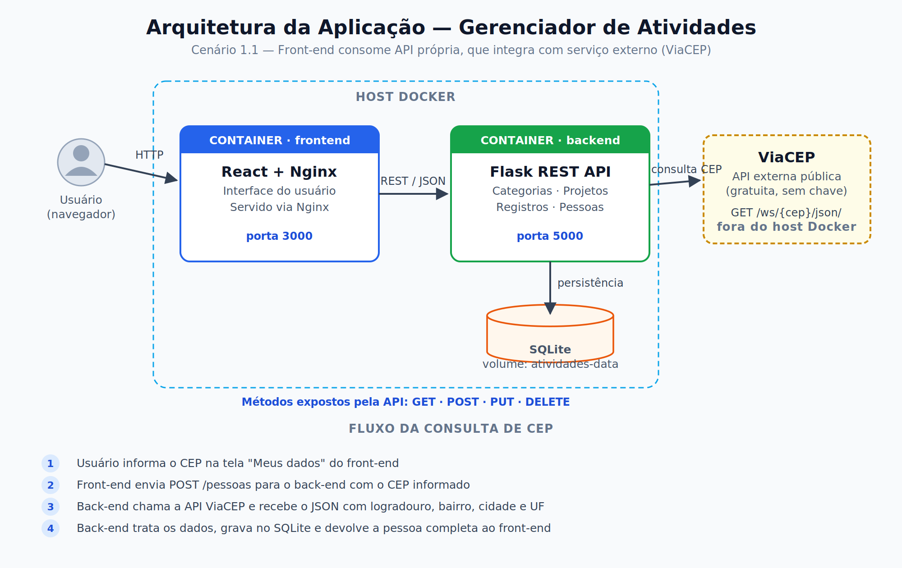
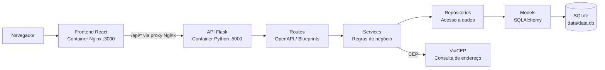
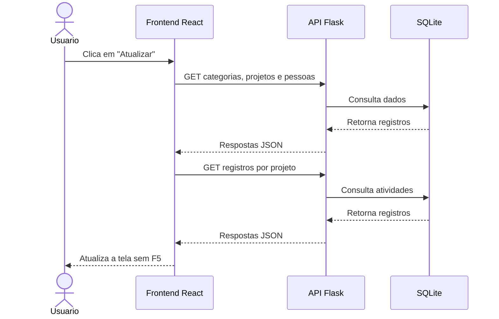

# Backend - Gerenciamento de atividades

API Rest para gerenciamento de atividades pessoais ou profissionais, organizados por projetos e categorias.

Este projeto está sendo desenvolvido como um MVP da Sprint 3 da Pós-graduação em Desenvolvimento Full Stack da PUC-Rio.

## Tecnologias

- **Python 3.13**
- **Flask** — framework web
- **flask-openapi3** — geração automática de documentação OpenAPI
- **SQLAlchemy** — ORM para acesso ao banco de dados
- **Pydantic** — validação e serialização de dados (schemas)
- **SQLite** — banco de dados relacional local
- **flask-cors** — suporte a CORS para consumo por frontends externos
- **Requests** — consumo da API externa ViaCEP
- **Docker** — containerização da aplicação

---

## Estrutura do Projeto

```
.
├── app.py                  # Ponto de entrada da aplicação
├── Dockerfile              # Configuração da imagem Docker
├── requirements.txt        # Dependências do projeto
├── data/
│   └── data.db             # Banco de dados SQLite (gerado automaticamente)
├── database/
│   └── database.py         # Configuração do engine e sessão do SQLAlchemy
├── models/
│   ├── categoria.py        # Modelo ORM: Categoria
│   ├── projeto.py          # Modelo ORM: Projeto
│   ├── registro.py         # Modelo ORM: Registro
│   └── pessoa.py           # Modelo ORM: Pessoa
├── schemas/
│   ├── categoria_schema.py # Schemas Pydantic: Categoria
│   ├── projeto_schema.py   # Schemas Pydantic: Projeto
│   ├── registro_schema.py  # Schemas Pydantic: Registro
│   └── pessoa_schema.py    # Schemas Pydantic: Pessoa
├── repositories/
│   ├── categoria_repository.py
│   ├── projeto_repository.py
│   ├── registro_repository.py
│   └── pessoa_repository.py
├── services/
│   ├── categoria_service.py
│   ├── projeto_service.py
│   ├── registro_service.py
│   └── pessoa_service.py
└── routes/
    ├── categoria_routes.py
    ├── projeto_routes.py
    ├── registro_routes.py
    └── pessoa_routes.py
```

---

## Arquitetura

O projeto segue uma arquitetura em camadas bem definida:

```
Routes → Services → Repositories → Models → Database
```

- **Routes** — define os endpoints e delega para o service
- **Services** — aplica regras de negócio e validações antes de acessar o banco
- **Repositories** — encapsula as operações de banco de dados via SQLAlchemy
- **Models** — mapeamento ORM das tabelas do banco de dados
- **Schemas** — validação de entrada e serialização de saída com Pydantic

### Arquitetura da solução <small><i>MACRO</i></small>




### Arquitetura da solução <small>+detalhes</small>



| Camada | Responsabilidade |
|--------|------------------|
| Frontend React | Interface, navegação, formulários e estado da tela |
| Nginx | Serve os arquivos React e encaminha `/api` para a API |
| Routes | Define endpoints e valida os schemas de entrada |
| Services | Aplica regras de negócio e consulta o ViaCEP |
| Repositories | Executa operações CRUD no banco |
| Models | Representa as tabelas do SQLite via SQLAlchemy |

### Fluxo de atualização do frontend



---

## Modelagem de Dados

```
Categoria
  └── id (PK)
  └── nome (único, obrigatório)
  └── projetos → [Projeto]

Projeto
  └── id (PK)
  └── nome (único, obrigatório)
  └── descricao (obrigatório)
  └── categoria_id (FK → Categoria)
  └── registros → [Registro]  (cascade: delete-orphan)

Registro
  └── id (PK)
  └── descricao (obrigatório)
  └── data (DateTime, default: agora)
  └── projeto_id (FK → Projeto)

Pessoa
  └── id (PK)
  └── nome (obrigatório)
  └── sobrenome (obrigatório)
  └── email (único, obrigatório)
  └── cep (obrigatório)
  └── numero (opcional)
  └── complemento (opcional)
  └── logradouro (preenchido pelo ViaCEP)
  └── bairro (opcional, preenchido pelo ViaCEP)
  └── cidade (preenchida pelo ViaCEP)
  └── uf (preenchida pelo ViaCEP)
```

> Não é possível deletar um **Projeto** com **Registros** associados.
> Categorias com projetos vinculados **não podem** ser deletadas.
>
> Ao criar ou atualizar uma **Pessoa**, o CEP é consultado na API [ViaCEP](https://viacep.com.br). O número e o bairro podem ser nulos para endereços que não possuem essas informações. A validação é realizada no backend.

---

## Endpoints

### Categorias — `/categorias`

| Método | Rota               | Descrição                     |
|--------|--------------------|-------------------------------|
| POST   | `/categorias/`     | Cria uma nova categoria        |
| GET    | `/categorias/`     | Lista todas as categorias      |
| GET    | `/categorias/{id}` | Busca uma categoria pelo ID    |
| PUT    | `/categorias/{id}` | Atualiza uma categoria pelo ID |
| DELETE | `/categorias/{id}` | Deleta uma categoria pelo ID   |

### Projetos — `/projetos`

| Método | Rota             | Descrição                    |
|--------|------------------|------------------------------|
| POST   | `/projetos/`     | Cria um novo projeto          |
| GET    | `/projetos/`     | Lista todos os projetos       |
| GET    | `/projetos/{id}` | Busca um projeto pelo ID      |
| PUT    | `/projetos/{id}` | Atualiza um projeto pelo ID   |
| DELETE | `/projetos/{id}` | Deleta um projeto pelo ID     |

### Registros — `/registros`

| Método | Rota                              | Descrição                       |
|--------|-----------------------------------|---------------------------------|
| POST   | `/registros/`                     | Adiciona um novo registro        |
| GET    | `/registros/projeto/{projeto_id}` | Lista registros de um projeto    |
| GET    | `/registros/{id}`                 | Busca um registro pelo ID        |
| PUT    | `/registros/{id}`                 | Atualiza a descrição de um registro |
| DELETE | `/registros/{id}`                 | Deleta um registro pelo ID       |

---

### Pessoas — `/pessoas`

| Método | Rota            | Descrição                                      |
|--------|-----------------|------------------------------------------------|
| POST   | `/pessoas/`     | Cria uma pessoa e consulta o endereço pelo CEP |
| GET    | `/pessoas/`     | Lista todas as pessoas                         |
| GET    | `/pessoas/{id}` | Busca uma pessoa pelo ID                       |
| PUT    | `/pessoas/{id}` | Atualiza uma pessoa pelo ID                    |
| DELETE | `/pessoas/{id}` | Deleta uma pessoa pelo ID                      |

---

## Execução local caso queira testar sem o docker

## Logo abaixo, em outra sessão, há detalhamento para execução via docker

### Pré-requisitos

- Python 3.10+
- pip
- Docker Desktop, para executar via container

### Instalação

```bash
# Clone o repositório
git clone <url-do-repositorio>
cd backend-atividades-por-projetos

# Crie e ative um ambiente virtual para encapsular as dependências do projeto
python -m venv venv
source venv/bin/activate  # Caso esteja em ambiente Linux/Mac, utilize esse comando
venv\Scripts\activate     # Caso esteja em ambiente Windwos, utilize esse comando

# Instale as dependências
pip install -r requirements.txt
```

### Executando

```bash
python app.py
```

A aplicação estará disponível em: `http://localhost:5000`

O banco de dados SQLite será criado automaticamente em `data/data.db` na primeira execução.

### Executando com Docker

Na raiz do projeto, construa a imagem:

```bash
docker build -t gerenciar-atividades-backend .
```

Inicie o container expondo a porta da API e montando o diretório do banco:

```bash
docker run --rm -p 5000:5000 -v "${PWD}/data:/app/data" gerenciar-atividades-backend
```

No PowerShell do Windows, use:

```powershell
docker run --rm -p 5000:5000 -v "${PWD}/data:/app/data" gerenciar-atividades-backend
```

O parâmetro `-v` mantém o banco SQLite no diretório `data/` do projeto mesmo depois que o container for encerrado.

Para executar o container em segundo plano:

```bash
docker run -d --name gerenciar-atividades-backend-api -p 5000:5000 -v "${PWD}/data:/app/data" gerenciar-atividades-backend
```

Para encerrar e remover o container:

```bash
docker stop gerenciar-atividades-backend-api
```

O arquivo `Dockerfile` instala as dependências, cria o diretório persistente do SQLite e inicia a aplicação na porta `5000`.

---

## Documentação Interativa

Ao acessar `http://localhost:5000`, você será redirecionado automaticamente para a documentação Swagger. 

Apesar de, no requisito do projeto, a documentação da API seja construída com Swagger (OpenAPI), as seguintes interfaces de documentação também estão disponíveis:

| Interface  | URL                        |
|------------|----------------------------|
| Swagger UI | `/openapi/swagger`         |
| Redoc      | `/openapi/redoc`           |
| RapiDoc    | `/openapi/rapidoc`         |
| Scalar     | `/openapi/scalar`          |
| RapiPDF    | `/openapi/rapipdf`         |
